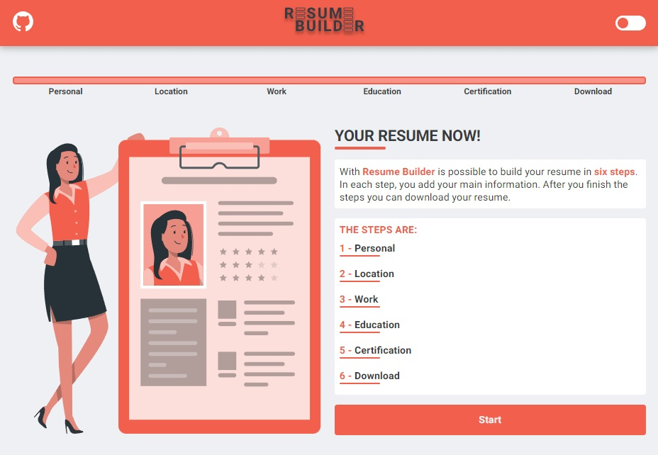

# Resume Builder

## Description

Resume Builder is a web app that generates a simple resume in pdf format after six steps.

Used api [https://countriesnow.space](https://countriesnow.space/) to get country, states and city data.

## Technologies used

- Next.js
- React
- React-hook-form
- Yup (validation library)
- Redux
- Redux-persist
- React-pdf
- Styled components (style and theme)

 

## Getting started

#### Clone this repository

`git clone https://github.com/gustavool/resume-builder.git`

#### Install dependencies

inside the main folder execute: `yarn install`

#### Run project

`yarn dev`
